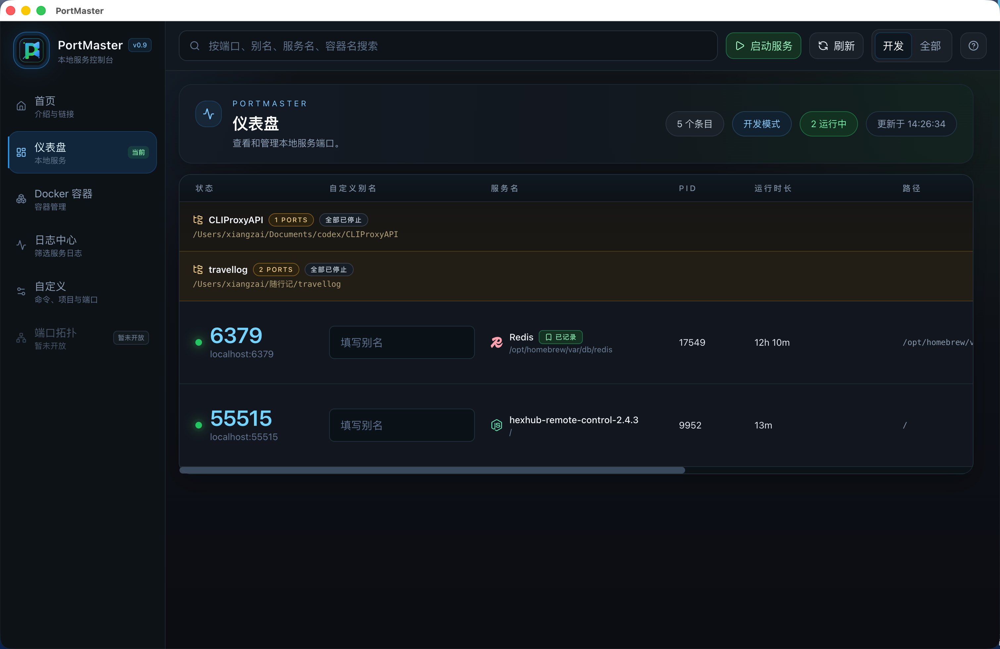
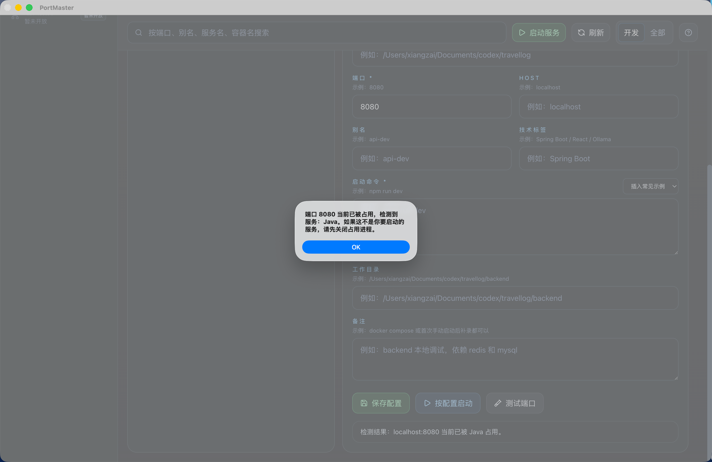
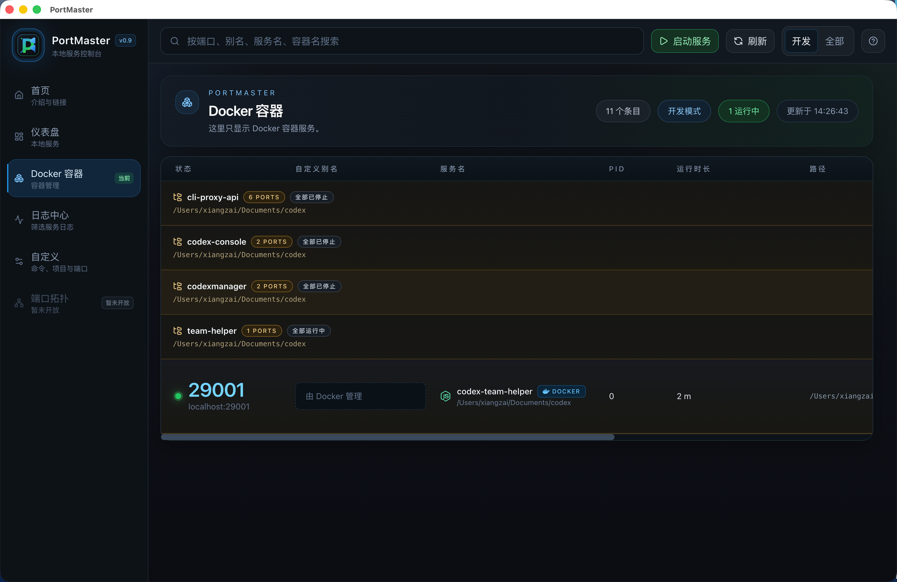
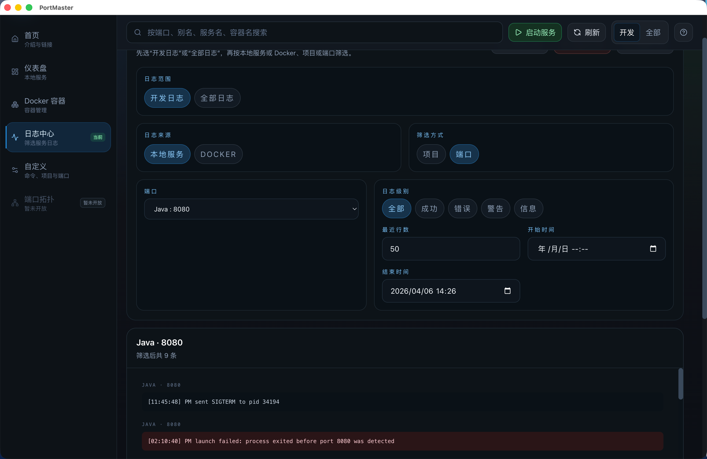
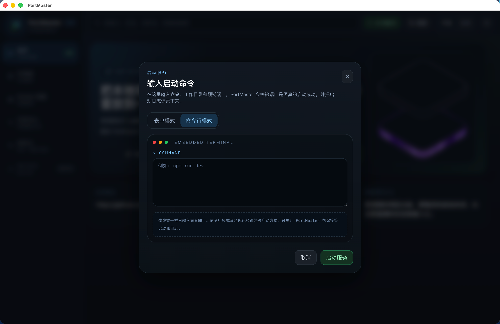
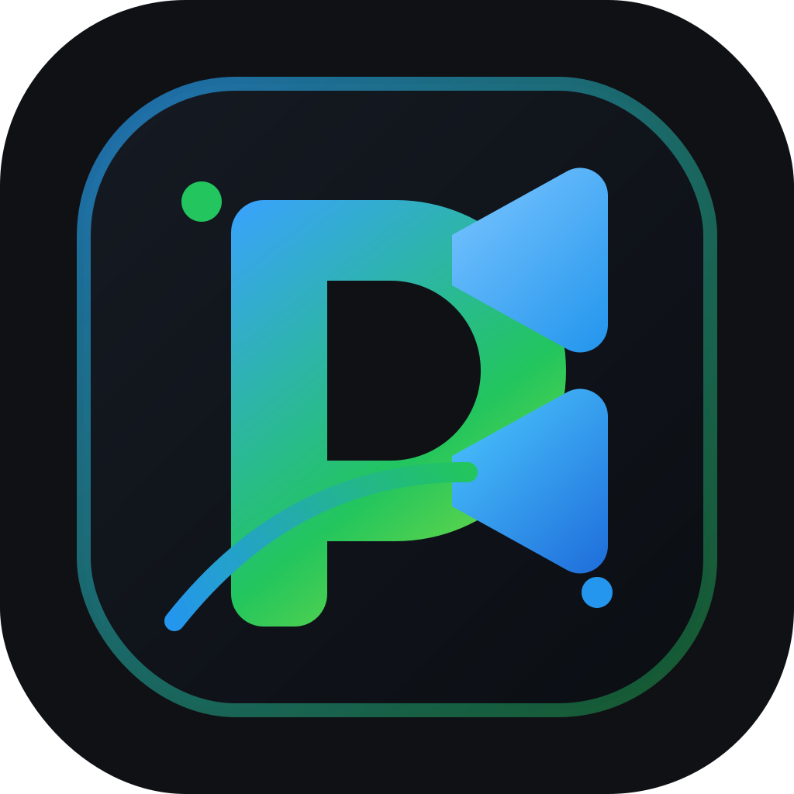

# PortMaster

PortMaster 是一个面向开发环境的桌面控制台，用来统一管理 `localhost` 端口、本地项目、Docker 容器和常用启动命令。

仓库地址：`https://github.com/myxsf/PortMaster`

## 它解决什么问题

很多本地开发工具只能“看到端口”，但真正日常会遇到的问题通常是这些：

- 端口关了没有
- 项目怎么再次启动
- Docker 服务到底算哪个项目
- 关闭后记录为什么不见了
- 日志要去哪里找

PortMaster 这版重点补的是“可启动、可记录、可复用”，把下面这条链路做完整：

- 发现本地服务和 Docker 容器
- 记录项目和端口
- 保存或推断启动命令
- 后续直接在面板里启动、关闭、查看日志

## 界面预览

### 仪表盘



仪表盘主要看本地服务，适合做这些事：

- 搜索端口、别名、服务名、路径
- 按项目折叠多个端口
- 结合记录能力快速回到常用项目
- 快速判断哪些服务正在运行，哪些只是“已记录但当前未启动”

### 端口占用提示



当你在“自定义”里测试端口或准备启动服务时，如果预期端口已经被其他服务占用，PortMaster 会直接弹出提示：

- 哪个端口被占用
- 检测到的大致服务类型
- 提醒你先关闭占用进程，再继续启动

### Docker 容器



Docker 容器页专门管理容器服务：

- 单独展示 Docker 服务，避免和本地项目混在一起
- 支持按服务分组查看容器端口
- 可以直接判断哪些容器组在运行、哪些已停止

### 日志中心



日志中心适合排查“为什么启动了但没真正起来”这类问题：

- 支持“开发日志 / 全部日志”切换
- 可以按本地服务或 Docker 来源筛选
- 可以按项目或端口进一步缩小范围
- 支持按错误、警告、信息等级筛选

### 命令行启动



命令行模式适合已经熟悉项目启动方式的用户：

- 像终端一样只输入命令即可
- PortMaster 会接管启动日志和端口校验
- 适合临时启动、调试命令和一次性验证

### 品牌图标



这个图标会用于桌面应用图标、README 展示和打包产物识别。

## 主要功能

- 扫描本机监听端口，识别常见开发服务
- 读取 Docker 容器端口，并在 Docker 页统一管理
- 给服务设置别名，方便按项目或用途区分
- 对正在运行的本地服务执行“记录”
- 把手动填写的项目配置保存在“自定义”页
- 常见 Java、Spring Boot、Node、Vue、Python、Go、Open WebUI、Ollama 提供命令示例
- 对已经记录过的服务，关闭后仍保留记录，后续可以直接再次 `Start`
- 项目组支持“记录项目”“全部启动”“全部关闭”
- 日志中心支持在“开发日志 / 全部日志”之间切换，并按项目或端口筛选

## 使用方式

### 方式一：先手动启动，再记录

适合已经有自己终端习惯的项目。

1. 在终端里先启动项目
2. 回到 PortMaster，找到对应端口
3. 点击“记录”
4. 以后这个服务即使关闭，也会保留在列表里
5. 下次直接点击“启动”

### 方式二：先在“自定义”里配置，再直接启动

适合固定命令的项目，或者自动识别不到合适命令的项目。

1. 打开左侧 `自定义`
2. 填写项目名、服务名、端口、工作目录、启动命令
3. 保存配置
4. 点击 `按配置启动`
5. 配置会同步出现在主列表里，后续可以直接复用

### 方式三：直接用“启动服务”弹窗

适合临时命令、一次性调试，或想先试跑再决定是否记录。

- 表单模式：适合你已经知道命令、工作目录和预期端口
- 命令行模式：适合你只想像终端一样输一条命令，让 PortMaster 接管启动和日志

## 下载与安装

### 方式一：从 GitHub 克隆仓库后本地安装

```bash
git clone https://github.com/myxsf/PortMaster.git
cd PortMaster
npm install
```

开发模式启动：

```bash
npm run dev
```

只启动前端调试页：

```bash
npm run dev:renderer
```

只用生产构建结果预览桌面端：

```bash
npm run desktop:preview
```

### 方式二：直接下载对应系统压缩包，解压即可

如果你不想本地装依赖，直接去 GitHub Release 下载对应系统的压缩包即可：

- macOS Apple Silicon：`PortMaster-0.0.0-macos-arm64.zip`
- macOS Intel：`PortMaster-0.0.0-macos-x64.zip`
- Windows x64：`PortMaster-0.0.0-windows-x64.zip`
- Windows 32 位：`PortMaster-0.0.0-windows-ia32.zip`

解压后直接运行应用即可。

如果你更喜欢安装版，也可以选择：

- macOS：`PortMaster-0.0.0-macos-arm64.dmg`
- macOS Intel：`PortMaster-0.0.0-macos-x64.dmg`
- Windows：`PortMaster-0.0.0-windows-x64-setup.exe`
- Windows 32 位：`PortMaster-0.0.0-windows-ia32-setup.exe`
- Windows 免安装：`PortMaster-0.0.0-windows-x64-portable.exe`
- Windows 32 位免安装：`PortMaster-0.0.0-windows-ia32-portable.exe`

## 开发与构建

安装依赖：

```bash
npm install
```

构建前端和 Electron 主进程：

```bash
npm run build
```

生成图标资源：

```bash
npm run generate:icons
```

启动链路冒烟测试：

```bash
npm run test:launch-smoke
```

这个测试会真实验证两条链路：

- 表单模式启动本地服务并识别端口
- 命令行模式启动本地服务并识别端口
- 两种模式都能成功关闭服务

## 打包命令

### macOS

ARM 版本：

```bash
npm run dist:mac:arm64
```

Intel 版本：

```bash
npm run dist:mac:x64
```

### Windows

ARM 版本：

```bash
npm run dist:win:arm64
```

X64 版本：

```bash
npm run dist:win:x64
```

32 位版本：

```bash
npm run dist:win:ia32
```

## 当前常见产物

打包后的文件默认在 `release/` 目录。

```text
release/PortMaster-0.0.0-macos-arm64.dmg
release/PortMaster-0.0.0-macos-arm64.zip
release/PortMaster-0.0.0-macos-x64.dmg
release/PortMaster-0.0.0-macos-x64.zip
release/PortMaster-0.0.0-windows-x64-setup.exe
release/PortMaster-0.0.0-windows-x64-portable.exe
release/PortMaster-0.0.0-windows-x64.zip
release/PortMaster-0.0.0-windows-ia32-setup.exe
release/PortMaster-0.0.0-windows-ia32-portable.exe
release/PortMaster-0.0.0-windows-ia32.zip
```

## 常见启动命令示例

```bash
# Spring Boot
./mvnw spring-boot:run

# Maven Java
mvn spring-boot:run

# Gradle Spring Boot
./gradlew bootRun

# React / Vue / Node
npm run dev

# Python
python main.py

# FastAPI
python -m uvicorn main:app --reload

# Go
go run .

# Open WebUI
docker compose up -d

# Ollama
ollama serve
```

## 使用建议

- 第一次启动不确定命令时，可以先手动启动一次，再回来“记录”
- 项目有多个端口时，建议都放到同一个项目名下，方便“全部启动 / 全部关闭”
- 如果点击“启动”后没起来，先看“查看日志”
- Docker 服务没起来时，先确认 Docker Desktop 已启动，再检查 compose 文件和镜像状态

## 本次更新重点

详见 [CHANGELOG.md](./CHANGELOG.md)。

这次主要补了这些：

- 修复“已停止服务被误判为端口占用”的问题
- 实装并验证“表单模式 / 命令行模式”两种启动方式
- 优化本地项目与 Docker 服务的项目分组逻辑
- 补回日志中心的“开发日志 / 全部日志”切换
- 调整大量用户文案，让提示更面向普通使用者

## 技术栈

- `React 19`
- `TypeScript`
- `Tailwind CSS v4`
- `Zustand`
- `Framer Motion`
- `Electron`
